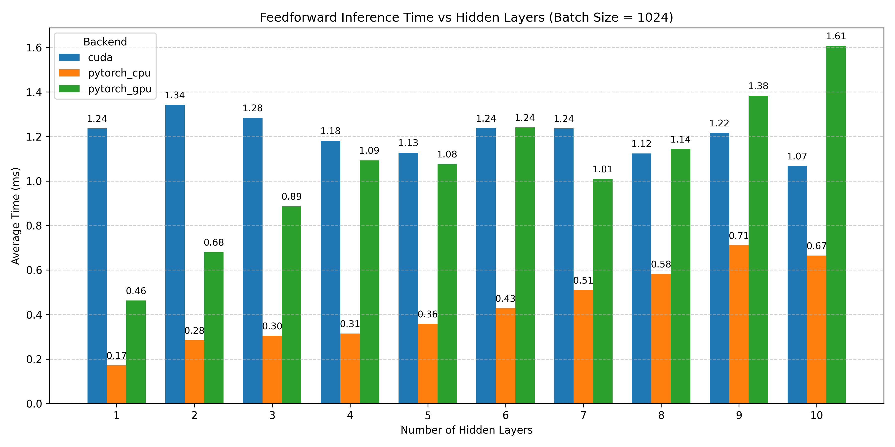

# W05_C16_feedforward_NN
Course: HW for AI &amp; ML, Week 5 Challenge 16, Simple feedforward Neural Network using CUDA.


### Benchmarking Feedforward Neural Networks on CPU, GPU, and CUDA

---

## TL;DR:

* **PyTorch CPU inference is the fastest** for small networks (1–10 hidden layers with 10 neurons in each layer).
* CUDA performance improves as the number of hidden layers increases, and in some cases approaches PyTorch GPU.
* While **writing raw CUDA kernels** may initially seem like the best way to achieve faster inference, **standard libraries like PyTorch and TensorFlow are highly optimized** to make full use of modern GPU architectures.
* These libraries leverage:
  * Fused kernels
  * Optimized memory access patterns
  * cuBLAS/cuDNN backends
  * Efficient caching and kernel launch strategies
* In practice, **PyTorch and TensorFlow often outperform hand-written CUDA** in most general use-cases — especially for models with standard layers and batch sizes.
* **Writing raw CUDA** is only advisable in **very niche scenarios**.
* For most cases, **using PyTorch or TensorFlow is easier, usually faster and safer.**

---

## Project Goal

This project aims to:

* Benchmark a **simple fully connected neural network (FCNN)** with increasing number of hidden layers (1 to 10).
* Compare **execution time** across:

  * **CUDA (custom kernel)**
  * **PyTorch GPU**
  * **PyTorch CPU**
* Ensure **fair benchmarking** by including all overheads: memory allocation, H2D/D2H copies, and kernel launch.
* Produce **plot-ready CSV files** and detailed performance comparison visuals.

---

## ⚙️ Experiment Setup

### Model Architecture

* **Input Size**: 4
* **Hidden Layers**: 1 to 10, each with 10 neurons
* **Output Size**: 1
* **Batch Size**: 1024
* **Activation**: ReLU (no dropout, no bias learning)

### Benchmarking Protocol

* Each configuration is run **100 times**.
* **First 2 runs are discarded** to avoid JIT warm-up / malloc delays.
* The **average of last 98 runs** is used for final measurement.

---

## 📤 Collected Results

### 🔹 Single Run Timing (Full Network Inference)

| Backend     | Batch Size | Avg Time (ms) |
| ----------- | ---------- | ------------- |
| CUDA        | 1024       | 1.7364        |
| PyTorch CPU | 1024       | 0.2540        |
| PyTorch GPU | 1024       | 0.7452        |

### Plot
<div style="text-align: left;">
    
</div>


> 🔍 **Note**: CPU is fastest here due to small network size and low transfer overhead.

---

### 🔹 Layer Scaling Timing (1 to 10 Hidden Layers)

| Hidden Layers | CUDA (ms) | PyTorch CPU (ms) | PyTorch GPU (ms) |
| ------------- | --------- | ---------------- | ---------------- |
| 1             | 1.2361    | 0.1717           | 0.4628           |
| 2             | 1.3417    | 0.2847           | 0.6800           |
| 3             | 1.2838    | 0.3046           | 0.8864           |
| 4             | 1.1805    | 0.3145           | 1.0926           |
| 5             | 1.1272    | 0.3581           | 1.0759           |
| 6             | 1.2371    | 0.4285           | 1.2406           |
| 7             | 1.2363    | 0.5095           | 1.0095           |
| 8             | 1.1239    | 0.5821           | 1.1433           |
| 9             | 1.2162    | 0.7103           | 1.3825           |
| 10            | 1.0672    | 0.6650           | 1.6075           |


### Plot

<div style="text-align: left;">
    
</div>

* X-axis: Number of Hidden Layers
* Y-axis: Average Inference Time (ms)
* 3 bars per layer: CUDA (blue), PyTorch CPU (orange), PyTorch GPU (green)
* Exact timing values are annotated above each bar


---

## 📂 File Structure

```
.
├── feedforward_NN.cu                       # CUDA benchmark code for single hidden layer
├── feedforward_NN_dynamic.cu               # CUDA benchmark code for (1-10) hidden layers
├── feedforward_NN_pytorch.py               # PyTorch benchmark code for 1 hidden layer
├── feedforward_NN_dynamic_pytorch.py       # PyTorch benchmark code for (1-10) hidden layers
├── feedforward_timing.csv                  # Benchmark results for 1 hidden layer
├── feedforward_layer_scaling.csv           # Benchmark results for 1-10 layers
├── plot_layer_scaling.py                   # Plotting script
├── plots/                                  # Output plots
    ├── feedforward_benchmark_plot.png      # Benchmark plot
    └── layer_scaling_comparison.png        # Output plot
```

---

## 🛠 How to Run

### CUDA Benchmark (creates + overwrites CSV)

```bash
nvcc -o feedforward_benchmark feedforward_benchmark.cu
./feedforward_benchmark 10
```

### PyTorch Benchmark (appends to same CSV)

```bash
# For CPU
python3 feedforward_NN_dynamic_pytorch.py cpu 10

# For GPU
python3 feedforward_NN_dynamic_pytorch.py gpu 10
```

### Plot the Results

```bash
python3 plot_layer_scaling.py
```
